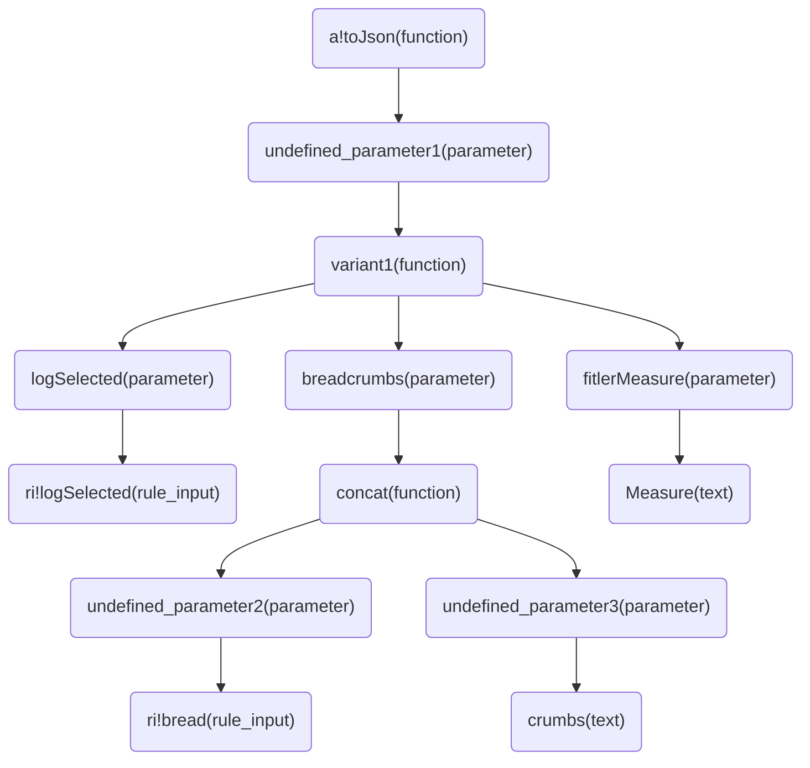

# SAIL Syntax Trees

The goal is to create syntax trees given an XML representation of a SAIL expressionable object 
(e.g., expression rules, interfaces). 

Because of the hierarchical nature of functions and values in SAIL, we can easily build syntax trees.

For example, given this SAIL expression:
```SAIL
a!toJson(
  {
    logSelected: ri!logSelected,
    breadcrumbs: concat(ri!bread, "crumbs"),
    filterMeasure: "Measure",
  }
)
```

This will be represented by syntax trees as:

Where each node contains the object's name and type. Possible types are `function`, `parameter`,
`comment`, `text`, `local variable`, `rule input`, and `function variable`.

# Usage
Pass a valid XML path to `get_syntax_tree_from_xml(xml_path: Path)` or a SAIL expression to 
`get_syntax_tree_from_sail(sail: str)`. See usage at the bottom of `syntax_tree_parsers.py`.

Returns:
1. root_object: `SailObject` type with properties
   1. name: name of object
   2. object_type: type of object
   3. line: where in the code the object was retrieved from
   4. values: list of `SailObject` objects that are the children of the object
2. names_map: `dict` type where the keys are the object names. This can be useful to get the 
values of common object names like "label", "placeholder", or "stampIcon".